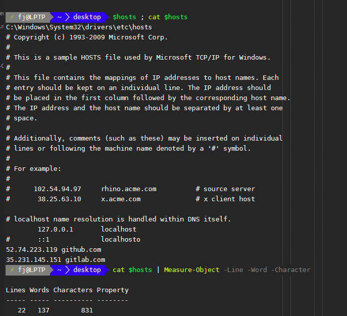
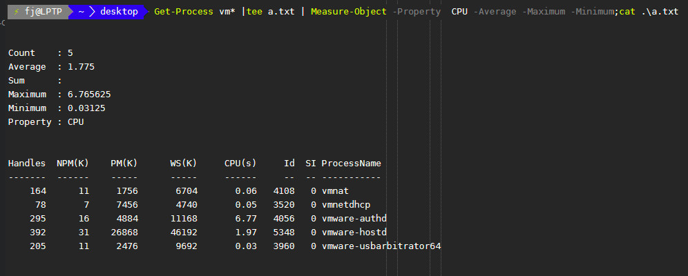
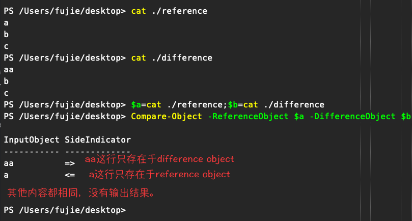
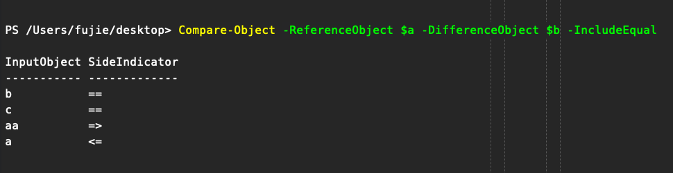
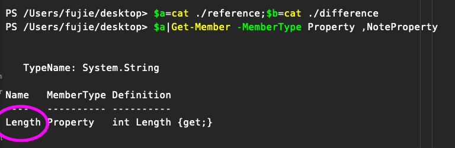
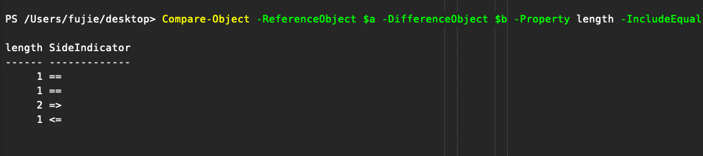
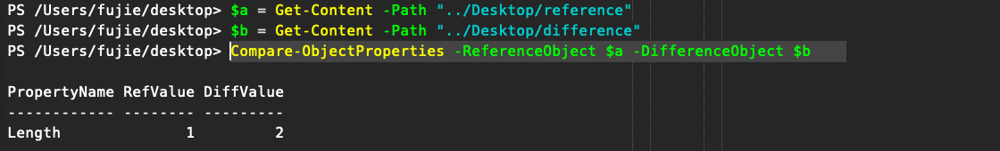

这个模块包括了许多PowerShell的基础管理命令.意味着该模块是非常通用的

## Measure-Object
### Description
`Measure-Object` 可以用来计算一个对象的数值型属性的值，主要有 `count` `max` `min` `sum`
`mean`.对于一个文件可以计算，文件的行数，单词数，字符数。(lines、words、characters)
### Alias
measure
### Examples

1. 统计某个文件的行数、字符数、文件数。
```powershell
# 查看win10系统hosts文件夹的行号，单词数，字符数。
$hosts ; Get-Content $hosts
Get-Content $hosts | Measure-Object -Line -Word -Character
```


2. 计算对象数值型属性的常用统计量。
```powershell
# 获得了windows中以vm开头的进程的cpu占有率这个数值型属性的最大值、最小值、平均值和数量特征。
# 使用tee对象将get-process输出结果保存到a.txt，同时传递给管道，作为measure-object输入，
# 并计算数值型属性 cpu占有率的常用统计量。最后打印出a.txt结果，与measure计算结果进行比较来验证命令的准确性。
Get-Process vm* |tee a.txt | Measure-Object -Property  CPU -Average -Maximum -Minimum;Get-Content .\a.txt
```


## Compare-Object
### Description
  + 比较2个对象的属性的区别,对于文件内容,根据每行的内容比较.默认输入2个对象分别是 `reference`
和 `difference`.当对象的某个内容只有 `reference` 有,则会输出这样的符号 `<=` 表示只有该对象才有的内容,
反之,当对象的某个内容或者属性只有 `difference` 有,则会标记这样的符号 `=>`.当2个对象的某个属性都相同则使用这个 `==`.
  + 默认情况下,当2个对象完全相同的情况下没有返回值.当其他一个对象为空的时候,报错.并且仅输出2个对象之间不同的地方.
  + 使用 `-IncludeEqual` 参数可以输出2个对象属性相同的地方.使用 `-ExcludeDifferent`参数只显示对象相同的属性.
  + 使用 `-CaseSensitive` 来确定比较是否大小写敏感,使用 `-Culture` 参数来指定区域型比较(不懂).

### Alias
compare、diff

### Examples
1. 使用默认方法,比较2个文本的内容.
    1. 文本名分别为 reference、difference,内容如下：
    ```Python
    #文件a reference
    a
    b
    c
    # 文件b difference
    aa
    b
    c
    ```
    2. 比较结果.
    ```powershell
    $a=cat ./reference;$b=cat ./difference
    Compare-Object -ReferenceObject $a -DifferenceObject $b
    ```
    

2. 输出相等行比较的结果.添加参数 `-InclueEqual`
```powershell
Compare-Object -ReferenceObject $a -DifferenceObject $b -IncludeEqual
```


3. 比较对象的属性.仍然使用之前的文件作为例子.当然比较其他对象也适用.
    1. 获取对象的属性
    ```powershell
    $a|Get-Member -MemberType Property ,NoteProperty # 输出只有length属性
    ```
    
    2. 比较length属性
    ```powershell
    Compare-Object -ReferenceObject $a -DifferenceObject $b -Property length -IncludeEqual
    ```
    可以看到有两行长度相等都为1,即一个字符,另外有一行`DifferenceObject`是长度为2,'ReferenceObject'是长度为1.
    
4. 扩展函数`Compare-ObjectProperties`比较2个对象的所有属性,在这里找到的! [源码地址](https://blogs.technet.microsoft.com/janesays/2017/04/25/compare-all-properties-of-two-objects-in-windows-powershell/),仍然使用2个文件作为实例.
```powershell
    # 原函数部分,可以用来比较2个对象所有属性的不同.
    Function Compare-ObjectProperties {
    Param(
        [PSObject]$ReferenceObject,
        [PSObject]$DifferenceObject
    )
    $objprops = Get-Member -InputObject $ReferenceObject  -MemberType Property, NoteProperty| ForEach-Object Name
    $objprops +=Get-Member  -InputObject $DifferenceObject  -MemberType Property, NoteProperty | ForEach-Object Name
    $objprops = $objprops | Sort-Object | Select-Object -Unique
    $diffs = @()
    foreach ($objprop in $objprops) {
        $diff = Compare-Object $ReferenceObject $DifferenceObject -Property $objprop
        if ($diff) {
            $diffprops = @{
                PropertyName = $objprop
                RefValue     = ($diff | Where-Object {$_.SideIndicator -eq '<='} | ForEach-Object $($objprop))
                DiffValue    = ($diff | Where-Object {$_.SideIndicator -eq '=>'} | ForEach-Object $($objprop))
            }
            $diffs += New-Object PSObject -Property $diffprops
        }
    }
    if ($diffs) {return ($diffs | Select-Object PropertyName, RefValue, DiffValue)}
   }

   # 实测部分,仍然比较2个文件.
   Compare-ObjectProperties -ReferenceObject $a -DifferenceObject $b
```

可以看出不需要指定属性就能找到有什么属性是不同的,但是这里没有提供输出属性值相同的部分.

<p class="recent_update" style="text-align: right;color: #108080;font-style: italic;font-size: large;">最后更新:2018-9-30 21:42:00</p>


