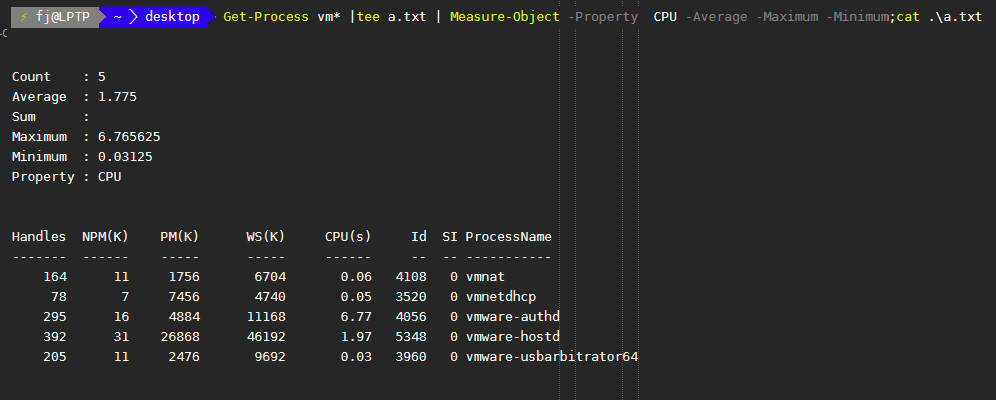

这个模块包括了许多PowerShell的基础管理命令.意味着该模块是非常通用的

## Measure-Object
`Measure-Object` 可以用来计算一个对象的数值型属性的值，主要有 `count` `max` `min` `sum`
`mean`.对于一个文件可以计算，文件的行数，单词数，字符数。(lines、words、characters)

### Example
1. 统计某个文件的行数、字符数、文件数。

```PowerShell
# 查看win10系统hosts文件夹的行号，单词数，字符数。
$hosts ; cat $hosts
cat $hosts | Measure-Object -Line -Word -Character
```


2. 计算对象数值型属性的常用统计量。

```PowerShell
# 获得了windows中以vm开头的进程的cpu占有率这个数值型属性的最大值、最小值、平均值和数量特征。

# 使用tee对象将get-process输出结果保存到a.txt，同时传递给管道，作为measure-object输入，
# 并计算数值型属性 cpu占有率的常用统计量。最后打印出a.txt结果，与measure计算结果进行比较来验证命令的准确性。
Get-Process vm* |tee a.txt | Measure-Object -Property  CPU -Average -Maximum -Minimum;cat .\a.txt
```



