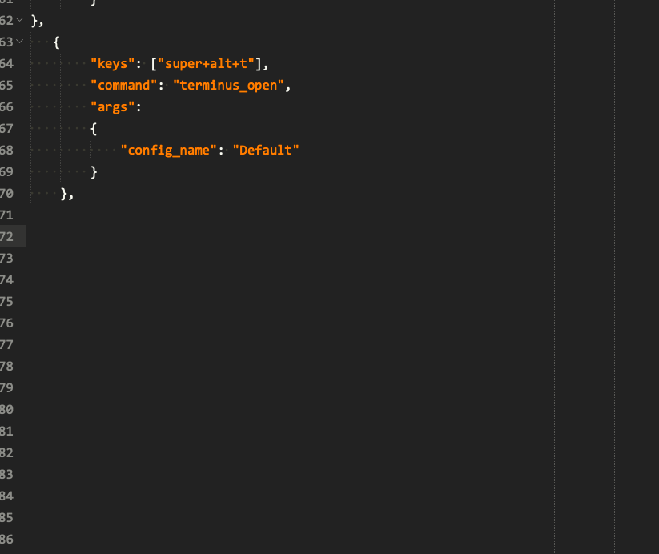

这里记录一些有关sublimetxt使用的一些技巧，做个备忘。

## sublimetext的程序菜单选项分别由一下文件组成。
    + Main.sublime-menu (也就是主菜单选项，通过修改这个文件可以修改主菜单的选项名等。)
    + Side Bar.sublime-menu (侧边栏右键菜单，同样可以修改选项名)
    + Context.sublime-menu (文本编辑窗口右键菜单)

## 修改首选项插件设置行为，使打开设置为默认和用户分屏效果.

+ json格式

```json
{
    "command": "edit_settings",
    "args":
    {
        // 根据插件的名字来修改下面2个路径的名字，一个是插件默认设置的安装位置，一个是用户安装位置。
        "base_file": "${packages}/SideBarEnhancements/Side Bar.sublime-settings",
        "default": "${packages}/User/Side Bar.sublime-settings"
    },
    "caption": "Settings"
},
```

+ 设置的xml代码片段

```xml
<!-- ${packages}需要转义！ -->
<snippet>
    <content><![CDATA[
{
    "command": "edit_settings",
    "caption": "设置",
    "args":
    {
        "base_file": "\$\{packages\}/${1:package_name}/${1:package_name}.sublime-settings",
        "default": "// Settings in here override those in \"${1:package_name}/${1:package_name}.sublime-settings\",\n// and are overridden in turn by syntax-specific settings.\n{\n\t$0\n}\n"
    },
},
]]></content>
    <tabTrigger>st</tabTrigger>
    <scope>source.json</scope>
</snippet>
```
## 快捷键设置代码片段

_NOTE_: 快捷键的设置是大小写敏感的,都是小写键来设置快捷键!

```xml
<snippet>
    <content><![CDATA[
{
    "keys":["${1:}"],
    "command": "${2:}",
    ${3:"args":
    {
        $4
    }
    }
}]]></content>
    <tabTrigger>kb</tabTrigger>
    <scope>source.json</scope>
    <description>按键绑定片段</description>
</snippet>
```


<p class="recent_update" style="text-align: right;color: #108080;font-style: italic;font-size: large;">最后更新:2018-10-02 20:55:08</p>
